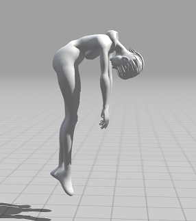

## Doing
- [ ] Make the character climb up on a box, and be able to jump down from it.
- [ ] Visialise for debugging where the hands / feet will be at the end of an animation cycle so we can maye figure out what to play / do to land on a certain spot.

## ApplicationAnimation Todo
- [ ] Implement hair tracking
- [ ] Implement hair bouncing or wind effect.
- [ ] Attach a physics object that follows her around with a delayed response.
- [ ] So we can have a cape that followes her around. Hair that moves when you move her.
- [ ] Make a small chain of physics objects that react to gravity that are also a skeleton.
- [ ] So whe can pick the character up, like  
 
- [x] Import a new mesh with seperate hair and eyes.

## Workflow for Blender -> Mixamo -> Blender -> App

From Blender to this application is easy. Export to glb. Import. Done.

From Blender you first bake a character in preferably a T-Pose or something close. Autorig in Mixamo. Export. Import.
Then in Blender the imported character animates, but the scale is all wrong.

- Remove the animation.
- Fix the skeleton scale to be 1 instead of 0.01. Set the rotation and position to 0.

Then re-import into Mixamo. Each subsequent import should now have the correct scale.

Each animation has a frame with a refrecen to the root object, that needs to be deleted.
And all the Bone names need to be renamed from *Left* to .L with a script.

Now you have a model that can be exported with all animations tied to it, and still mirrored editing works.

Using Mixamo control Rig:
TBD

## General Notes Findings and Frustrations

Some goals and findings.

Okay. We're lazy, so we'd like to use a model from Sketchfab right.
It has to not be completely horrible and AI slop. There are some OK models, 50k polys. But they are always in some weird size/format orientation and are split up in 100 bits with a thousand duplicate polygons.

Fine. This can be fixed.

It's now in a random pose. Usually resembling maybe a T or A pose. But not quite.

Mixamo is the best at rigging these random poses.
Cartwheel is absolute garbage at it. It takes either forever processing, or just twist the model in to obvious wrong poses.

Interestingly enough. They spit out almost the same skeleton. It has identical names.
The cartweel exports to a 10000x size, weird orientation but overall... usable.

It'd be nice if we can have a single skeleton that's the same in both these studios.

UE5 is still generating an empty project in the mean time...

When you download from Cartwheel using the Blender settings, you get more garbage than not using the blender settings. So better off leaving everything default. And don't touch anything.

If you simply export GLTF, you have to remove the 38km sized icospheres that they've conveniently added as bone. Then you resize all bones by a factor or 1/100 on their individual origins. And voila. You have something that at least looks sensible.

The only weird thing being that the Toe bases are not attached to the feet. And the Heels are attached to the legs, not the lower legs.

Mixamo now just works.

To get animations from Cartwheel, you need to download a new animation. But these are scaled by a factor of 10.000. Because everything needs to be 10km in size....

Set the scale of everything in blender to a factor of 1000.

Then import
Then resize bones and remove icohedron.
Then fix the animation by scaling everyting only by 1/100.
And now there is less jitter... because blender can't scale animation data properly. Maybe they use 16 bit floats?

## Bones

Bone's have a slightly weird thing going on orientation wise, even in Blender they are not a default object but have some more going on.

A Bone in Blender has a Roll property. Seperate from an object's roll.
Moving a bone up moves the bone in the direction from tail to head.

