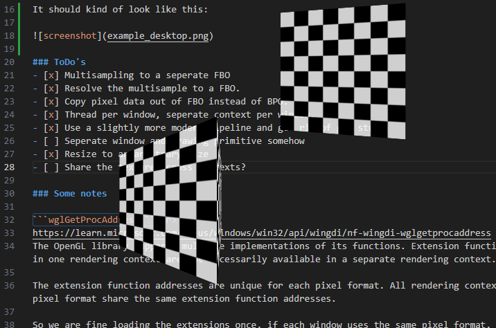

This repository was built on:
Initial running example from https://www.dhpoware.com/demos/glLayeredWindows.html<br>
Example is from 2010 and uses uses PBuffer and the old GL pipeline.
The copyright is included in `copyright.md`

All code in this repository is supplied with the same copyright.

### Changes
- This builds on MinGW instead of VS2010 with the supplied makefile, and builds a relatively small executable.
- Simple shader instead of fixed pipeline.
- The cube is anti-aliased with smooth texture filtering.
- The white squares should be slightly see-through.
- A new thread can be spawned which creates a new window with it's own OpenGL context. Change `num_threads = 1`
- It can render to a normal window by requesting `CreateNewWindow` instead of `CreateNewLayeredWindow`
- ImagePreMultAlpha function makes no sense, removed. You can just let OpenGL do this for you with glBlendFunc

It should kind of look like this:



### Folder structure
`/core`         Contains all core files for this 'Engine'.
`/shaders`      Contains default shaders.
`/applications` Contain different applications that test / implement different things.
`/3rdparty/*`   Contains external libraries source code, either as an entire repo or single files.

### Doing:

Set a camera's initial position and lookat to something. It should have an up vector change.

### ToDo's

- [ ] Share the texture across contexts?
- [ ] Assign different materials to objects by storing their material index in a sperate VAO.
- [ ] Scale window and framebuffers
- [x] Attempt to put ImGui in and keep the crazy overlay going.
- [x] Compile ImGUI once to a library.
- [ ] Object selection based on ID with a buffer...? SSBO read/write from FS doesn't work optimally.
- [ ] Since we want deferred rendering for SSAO, it will solve the ID selection problem.
- [ ] Continue testing things on Intel IGPs
- [ ] Some visual properties, like material etc. Are they updated on phsysics?
- [ ] Different test scene's with different behaviours require an application, that ties all the logic together.
- [ ] Resize full screen and back to something small
- [ ] Textures. Will bindless work on Intel? Should be nice.
- [ ] Test a model imported from Blender with Materials in OBJ .mat file.
- [ ] Use header stb lib to load png/jpg with/without Alpha.
- [ ] Figure out how to do sound?
- [ ] Some kind of project structure, where different games/applications can exist and you can build one or more of them.
- [ ] Maybe have some kind of test / example thing.
- [ ] Most application / game things we have in mind have a 2D asthetic. Maybe 2D physics are interesting in a 3D rendered environment.
- [ ] Bindless textures are a pain and broken. Texture Arrays are nicer, and can at least be debugged. We can implement atlas in a normal texture, or in a texture array.
- [ ] Load materials from OBJ file and store them somewhere so they can be indexed / adressed.

### Done's
- [x] Multisampling to a seperate FBO
- [x] Resolve the multisample to a FBO.
- [x] Copy pixel data out of FBO instead of BPO.
- [x] Thread per window, seperate context per window.
- [x] Use a slightly more modern pipeline and get rid of glu stuff.
- [x] Seperate window and drawing primitive somehow
- [x] Resize to an arbitrary size
- [x] Use named versions of Frame/Renderbuffers
- [x] Continue rotating while being dragged...
- [x] Add another instance of cube
- [x] Add another object type... sphere?
- [x] Move something with input
- [x] Compute shader to generate the texture
- [x] Have some kind of global list of materials somewhere
- [x] Assign different textures to materials
- [x] A seperate physics thread that updates object positions and manages input
- [x] A scene to put things in.
- [x] Simple lighting, but keep in mind it needs to be PBR at some point.
- [x] Make the hovered / selected object use a certain material.
- [x] Blue and Red are reversed somewhere.. somehow.
- [x] All files / assets that are loaded from file should be compilable into the application by some kind of asset manager.


### Some notes

https://github.com/fendevel/Guide-to-Modern-OpenGL-Functions

```wglGetProcAddress```<br>
https://learn.microsoft.com/en-us/windows/win32/api/wingdi/nf-wingdi-wglgetprocaddress
The OpenGL library supports multiple implementations of its functions. Extension functions supported in one rendering context are not necessarily available in a separate rendering context.

The extension function addresses are unique for each pixel format. All rendering contexts of a given pixel format share the same extension function addresses.

So we are fine loading the extensions once, if each window uses the same pixel format.

```wglMakeCurrent```<br>
A thread can have one current rendering context. A process can have multiple rendering contexts by means of multithreading.

A thread must set a current rendering context before calling any OpenGL functions. Otherwise, all OpenGL calls are ignored.

A rendering context can be current to only one thread at a time. You cannot make a rendering context current to multiple threads.

An application can perform multithread drawing by making different rendering contexts current to different threads, supplying each thread with its own rendering context and device context.

https://www.shadertoy.com/view/ld2Gz3

Deferred shading from LearnOpenGL, or anything, doesn't use MSAA. Because... what's the position or normal for a fragment that's a blend of different fragments...? Actually... why wouldn't it? It can blend normals, the blended edges just get a curved normal. Blending to transparent would probably be weird...

ImGui: ImGui_ImplWin32_EnableAlphaCompositing needs to be commented out. It's a Windows 7 feature.

### Rendering / Input / Physics

Physics, input and rendering can be completely decouplped, but they have to talk to each other at some point.
i.e. Physics an run at 100Hz, FPS at 75Hz. We can sample input at framerate, but maybe it's better at physics.
Physics can be slower, in which case the same frame will be drawn multiple times.

Physics will always attempt to run at set rate, so it makes sense to couple input and networking to the Physics rate.

Some input, like which object is selected or settings from a UI, are only gatherd after a frame was completed. Let's say in the UI we get an object ID that we've selected, and we move the object by one in Z direction. These 2 inputs, the object id and the move command need to be queued as an input, and processed next time the input gathers it's information.

Networking: You'd ideally just submit which buttons were pressed. If the other client is running at 10FPS and you are at 60FPS but both physics are at 50FPS, the input from the other client with respect to object selection will not be as fast. But replaying you input will still happen at 50Hz. And the fact that his UI is lagging does not mean anything for you, since it's keyboard and mouse can still be polled at 50Hz. Although he won't see them with the same speed as you.

### Input
Input can be fetched from the messages sent to a window, but this ties the input thread to a different thread than the render thread.

### Tested
Video Cards:
 - Intel HD Graphics 520 (Thinkpad T460s)
 - NVidia RTX 2070
 - AMD FirePro M4000 (Elitebook 8570W)

Fragment shader writes ObjectID to a SSBO when the fragment at mouse position is being rendered. This has some problems with Z testing.