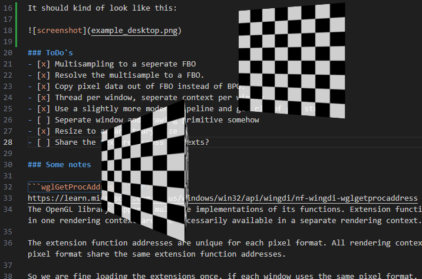

    This repository was built on:
Initial running example from https://www.dhpoware.com/demos/glLayeredWindows.html<br>
Example is from 2010 and uses uses PBuffer and the old GL pipeline.
The copyright is included in `copyright.md`

All code in this repository is supplied with the same copyright.

- It should be Unity-like, just with a load where your coffe is still hot when it's finally done.
- Without an account.
- Have the same amount of supplied content: Nothing.
- Without the scripting.

### Changes
- This builds on MinGW instead of VS2010 with the supplied makefile, and builds a relatively small executable.
- Simple shader instead of fixed pipeline.
- The cube is anti-aliased with smooth texture filtering.
- The white squares should be slightly see-through.
- A new thread can be spawned which creates a new window with it's own OpenGL context. Change `num_threads = 1`
- It can render to a normal window by requesting `CreateNewWindow` instead of `CreateNewLayeredWindow`
- ImagePreMultAlpha function makes no sense, removed. You can just let OpenGL do this for you with glBlendFunc

It should kind of look like this:



### Folder structure
`/core`         Contains all core files for this 'Engine'.
`/shaders`      Contains default shaders.
`/applications` Contain different applications that test / implement different things.
`/3rdparty/*`   Contains external libraries source code, either as an entire repo or single files.

### Doing:
- [x] Load materials from OBJ file and store them somewhere so they can be indexed / adressed.
- [x] Set a camera's initial position and lookat to something. It should have an up vector change.
- [x] Automatically merge different materials based on name. And auto assign to an object on mesh load from OBJ.
- [x] Auto load texture data from .mat file.
- [x] Normal Mapping https://youtu.be/hOLLh80hDmw?si=-nQxkodGUvsnA35I
- [ ] Make sperate light calculation for directional and point lights.
- [ ] Cubemaps. Can be merged in the main shader.

### ToDo's

- [ ] Load Spherical skyboxes from a .pbr file (should work with stb_image) and use them... view them... or cubemap them.
- [ ] The Mat3 rotation used to also rotate normals in the vertex shader needs to be renormalised. Why?
- [ ] Project camera and cursor throught the camera, in order to figure out where in the grid you are.
- [ ] Have a grid that isn't several objects...
- [ ] Grid tiles should have a module system, as a seperate standalone system that let's you connect things like roads, bricks etc. with
      some wave-function collapse type deal.
- [ ] Camera isometric / perspective.
- [ ] eye_position setting is not working on AMD...? It doesn't like glUniform3fv to uniforms that arent an array?
- [ ] Share the texture across contexts?
- [x] Assign different materials to objects by storing their material index in a sperate VAO.
- [ ] Make OBJ file not require UV to be present so it only uses color.
- [ ] Scale window and framebuffers
- [x] Attempt to put ImGui in and keep the crazy overlay going.
- [x] Compile ImGUI once to a library.
- [x] Object selection based on ID with a buffer...? SSBO read/write from FS doesn't work optimally.
- [ ] Since we want deferred rendering for SSAO, it will solve the ID selection problem.
- [ ] Continue testing things on Intel IGPs
- [ ] Some visual properties, like material etc. Are they updated on phsysics?
- [x] Different test scene's with different behaviours require an application, that ties all the logic together.
- [ ] Resize full screen and back to something small
- [x] Textures. Will bindless work on Intel? Should be nice.
- [x] Test a model imported from Blender with Materials in OBJ .mat file.
- [x] Use header stb lib to load png/jpg with/without Alpha.
- [x] Figure out how to do sound?
- [ ] LoadFile may load an asset from memory. The returned data may not be freed? Check and Fix.
- [ ] Some kind of project structure, where different games/applications can exist and you can build one or more of them.
- [ ] Maybe have some kind of test / example thing.
- [ ] Most application / game things we have in mind have a 2D asthetic. Maybe 2D physics are interesting in a 3D rendered environment.
- [ ] Bindless textures are a pain and broken. Texture Arrays are nicer, and can at least be debugged. We can implement atlas in a normal texture, or in a texture array. https://ktstephano.github.io/rendering/opengl/bindless
- [ ] Switch between bindless and non-bindless?
- [ ] Switch on/off backface culling for leaves and other thin things with transparency... although.... viewing it from above might not make a difference. Now we discard fragments on an opacity threshold... which is easy and not totaly horrible.


### Todos Game Specific
- [ ] Have a grid with layers, where the mouse + inverser of camera get's converted back to a coordinate. Maybe use some kind of overlay shader to draw a grid with the current camera settings first. Needs an ability to overlay shaders for a specific program.
- [ ] A menu when right clicking to place walls on a tile, or hold and drag.

### TODOs Space Sim Specific

- Goal of the game? Become a Type II civilication? Wipe out all other forms of life? Become the biggest?

We need a sort of reproducable random and normal distribution generator that works the same in code, accross machines and perhaps even in shaders.
We use a single 1k texture as a uniform noise where all our randomness comes from. The 'seed' value is just the starting index in this texture.

- Now we can generate a star system with some stars and planets normally distributed according... to science?


### Isometric RPG Thing

- Rooms, levels. Have a menu pop up when clicking a tile: Add walls, door or window to 4 directions. Make it detect area's like rooms and highlight them.

### Done's
- [x] Multisampling to a seperate FBO
- [x] Resolve the multisample to a FBO.
- [x] Copy pixel data out of FBO instead of BPO.
- [x] Thread per window, seperate context per window.
- [x] Use a slightly more modern pipeline and get rid of glu stuff.
- [x] Seperate window and drawing primitive somehow
- [x] Resize to an arbitrary size
- [x] Use named versions of Frame/Renderbuffers
- [x] Continue rotating while being dragged...
- [x] Add another instance of cube
- [x] Add another object type... sphere?
- [x] Move something with input
- [x] Compute shader to generate the texture
- [x] Have some kind of global list of materials somewhere
- [x] Assign different textures to materials
- [x] A seperate physics thread that updates object positions and manages input
- [x] A scene to put things in.
- [x] Simple lighting, but keep in mind it needs to be PBR at some point.
- [x] Make the hovered / selected object use a certain material.
- [x] Blue and Red are reversed somewhere.. somehow.
- [x] All files / assets that are loaded from file should be compilable into the application by some kind of asset manager.


### Some notes

https://github.com/fendevel/Guide-to-Modern-OpenGL-Functions

```wglGetProcAddress```<br>
https://learn.microsoft.com/en-us/windows/win32/api/wingdi/nf-wingdi-wglgetprocaddress
The OpenGL library supports multiple implementations of its functions. Extension functions supported in one rendering context are not necessarily available in a separate rendering context.

The extension function addresses are unique for each pixel format. All rendering contexts of a given pixel format share the same extension function addresses.

So we are fine loading the extensions once, if each window uses the same pixel format.

```wglMakeCurrent```<br>
A thread can have one current rendering context. A process can have multiple rendering contexts by means of multithreading.

A thread must set a current rendering context before calling any OpenGL functions. Otherwise, all OpenGL calls are ignored.

A rendering context can be current to only one thread at a time. You cannot make a rendering context current to multiple threads.

An application can perform multithread drawing by making different rendering contexts current to different threads, supplying each thread with its own rendering context and device context.

https://www.shadertoy.com/view/ld2Gz3

Deferred shading from LearnOpenGL, or anything, doesn't use MSAA. Because... what's the position or normal for a fragment that's a blend of different fragments...? Actually... why wouldn't it? It can blend normals, the blended edges just get a curved normal. Blending to transparent would probably be weird...

ImGui: ImGui_ImplWin32_EnableAlphaCompositing needs to be commented out. It's a Windows 7 feature.

### Header only libraries

Since we dont have any include hierarchy thing which tells us what file to recompile, header only files are horrible.
So, we un-header only them and split them into a source and actual header file... which... makes more sense anyway.
Primarily for compile time reasons. If I want to wait for things, I'll use Unity.

### Rendering / Input / Physics

Physics, input and rendering can be completely decouplped, but they have to talk to each other at some point.
i.e. Physics an run at 100Hz, FPS at 75Hz. We can sample input at framerate, but maybe it's better at physics.
Physics can be slower, in which case the same frame will be drawn multiple times.

Physics will always attempt to run at set rate, so it makes sense to couple input and networking to the Physics rate.

Some input, like which object is selected or settings from a UI, are only gatherd after a frame was completed. Let's say in the UI we get an object ID that we've selected, and we move the object by one in Z direction. These 2 inputs, the object id and the move command need to be queued as an input, and processed next time the input gathers it's information.

Render Thread will do:
 - Render Scene
 - Render UI

Physics Thread will do:
 - Input Handling
 - Custom Logic
 - Physics

Objects that need to be added, or removed can only be done when both threads are not using them. This needs to
be synced.


Networking: You'd ideally just submit which buttons were pressed. If the other client is running at 10FPS and you are at 60FPS but both physics are at 50FPS, the input from the other client with respect to object selection will not be as fast. But replaying you input will still happen at 50Hz. And the fact that his UI is lagging does not mean anything for you, since it's keyboard and mouse can still be polled at 50Hz. Although he won't see them with the same speed as you.

### Materials

A .OBJ file has an associated .MAT file with it. Let's say object A has 3 materials, and object B has 3, but the first one is the same as one in A.

A: grass, rock, dirt
B: metal, rock, concrete

Globally, rocks gets index 1 assigned.

Both meshes get 3 material slots, which map to the 3 materials. Using PickMaterials the three slots pick the corresponding material from the total loaded materials.

Vertices and thus meshes have a material index, these refer to the material slots.
In an object, each slot can be assigned a different material, while having the same mesh.

In a GLB file all data can be packed into a single file, but the output is the same.

### Skinned Meshes / Armatures / Bones

A skinned mesh is different from a normal mesh, in that each vertex has a list of bones that can influence it and an equally long list of weights or factors that influence it.

When we want to batch skinned meshes, we'd want to play different animation frames or even interpolated frames on each instance of a mesh. They may have the same bones, but each object needs a copy of this bone data.
Therefore it works the same as materials.
A vertex get's a bone index. This index references a list in an armature with which it was created.

### Animation

Skeletal animation might be easiest when all the animations are in place. With complex animations however, it's nice to have the position 'encoded' in the bone position.

### Input
Input can be fetched from the messages sent to a window, but this ties the input thread to a different thread than the render thread.

### Tested
Video Cards:
 - Intel HD Graphics 520 (Thinkpad T460s)
 - NVidia RTX 2070
 - AMD FirePro M4000 (Elitebook 8570W)

Fragment shader writes ObjectID to a SSBO when the fragment at mouse position is being rendered. This has some problems with Z testing.

### Spite Sheet Tools
SpiteSheet Packer
Aseprite
Tiled